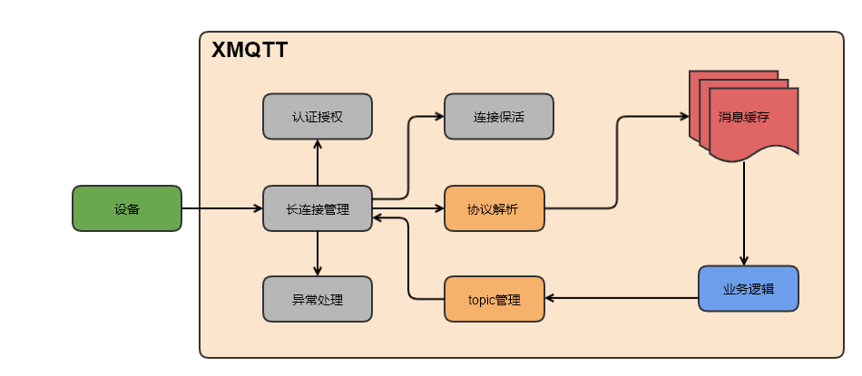

# XMQTT

[](https://travis-ci.com/xfyun/AthenaServing)
[](https://golang.org/)
[](https://github.com/xfyun/AthenaServing/blob/master/LICENSE)
[](README_EN.md)
[](README.md)

## 介绍

XMQTT是一个完全开源的MQTT消息代理，适用于物联网、M2M和移动应用程序，可以处理百万并发的客户端连接。
为设备提供安全可靠的连接通信能力，向下连接海量设备，支撑设备数据采集上云，并且完全兼容MQTT 3.1和3.1.1规范。
它是基于开源项目[surgemq](https://github.com/zentures/surgemq) 进行开发的，
在此基础上对稳定性和性能做出了改善，并增加了一些新的特性。

### 逻辑架构图



### 特性

- 支持QOS0,1和2消息
- 支持遗嘱消息
- 支持保留消息
- Ack 超时和重试机制（基于时间轮的定时机制）
- 支持智能心跳，支持客户端在不同场景及时调整

### 稳定性和性能提升

- 使用多级缓存队列改善长连接频繁建连以及弱网情况下的内存泄漏
- 使用动态缓存按需分配接受和发送缓冲队列大小，降低内存消耗
- 定时清理环形缓存队列，避免高并发场景下的内存泄漏
- 单机百万连接

## 应用场景
- 物联网云平台
- 智能硬件开发
- 车联网
- 智能家居&智慧家庭
- 工业制造

## 构建
- 命令行
```bigquery
go get github.com/xmqtt
go mod download
go build
```

- docker
```bigquery
docker build -t xmqtt:v1 .
```

## 运行
- 命令行
```bigquery
./xmqtt
```
- docker
```bigquery
docker run -d -p 1883:1883 xmqtt:v1
```

## client 示例
client demo 实现了MQTT pub 和 sub 功能，可以通过以下命令启动运行:
```
cd test/client
go build
./client
```

## 联系我们
